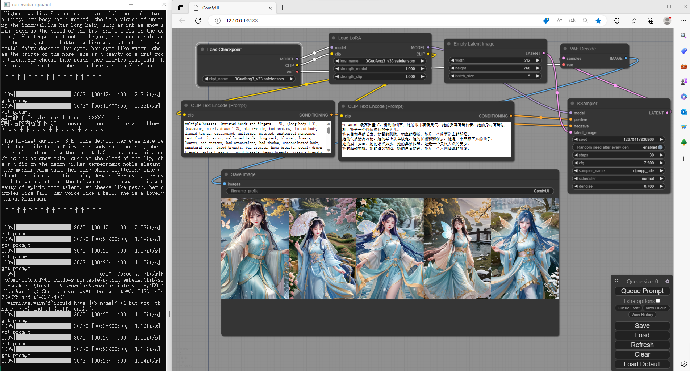
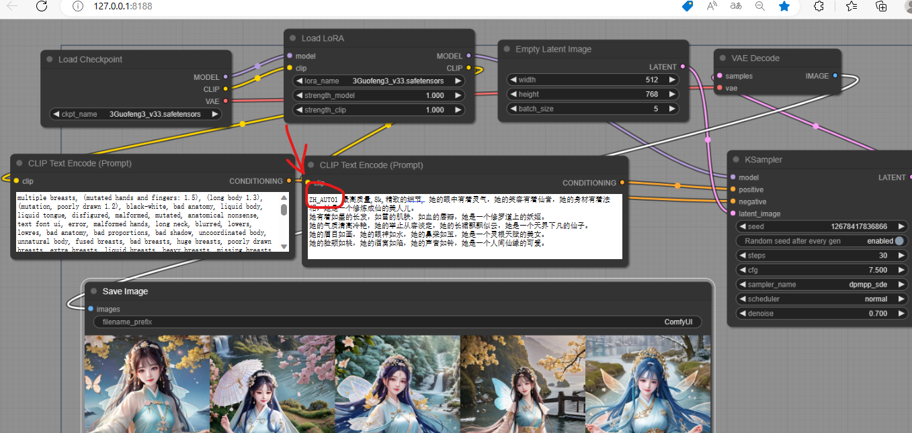
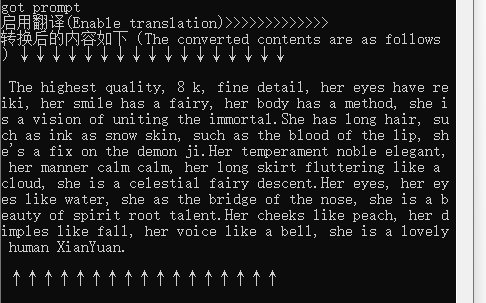

# comfy_Translation

# 更新 20230413 19:40
# *更新内容如下*
```
1、优化代码
2、修复生成后的图片带的tag信息为中文问题
3、增加使用自定义浏览器打开ComfyUI功能
```
# 自定义浏览器使用方法

## 1）增加openIE.txt，把**openIE.txt**放到**ComfyUI\custom_nodes**里，修改里面要启动浏览器的路径

## 2）浏览器路径：找到你的浏览器->鼠标右键->打开文件所在位置->复制.exe的路径进来

## 如：
```
PATH="C:\Program Files (x86)\Microsoft\Edge\Application\msedge.exe"
```

## 3）重启ComfyUI
## 打开自定义浏览器，如果配置了openIE.txt，会去获取里面路径打开你想要打开的浏览器，如果没有这个文件，则按默认方式去打开
## Open the custom browser, if configured with openIE.txt, will go to the inside path to open the browser you want to open
## TODO 目前会打开两个浏览器，一个是默认一个是自定义的，需要你手动关闭不想要打开的浏览器
## TODO currently opens two browsers, one by default and one by custom, requiring you to manually close any browser you don't want to open
## 这里很抱歉无法屏蔽ComfyUI去打开默认浏览器，我会尝试找[ComfyUI](https://github.com/comfyanonymous/ComfyUI)的作者看看能否修改一下他们的代码好让我们可以去自定义打开浏览器
## I'm sorry that I can't block ComfyUI to open the default browser. I will try to find the ComfyUI authors to see if they can modify their code so that we can customize the browser to open

# **安装**
1、直接下载压缩包

2、使用git clone下载，连接如下：
```
git clone https://github.com/laojingwei/comfy_Translation.git
```
# **使用方法**
1、如果是压缩包，先进行解压，然后把**comfy_Translation.py**放到**ComfyUI\custom_nodes**里

2、如是克隆下来的，也先把**comfy_Translation.py**放到**ComfyUI\custom_nodes**里

3、**重启**ComfyUI

4、在**clip Text encode**里直接输入 **ZH_CN2EN**等关键词，后面你可以根据自己发挥自由输入中文关键词，工程建好后点击渲染，这时会自动把中文转成英文送给ai进行绘制

# **翻译启动关键词解释**
1、**ZH_CN2EN**
```
不管是否中英文混合，统统转为英文（建议使用）
```
2、**ZH_CN2EN1**
```
同ZH_CN2EN不管是否中英文混合，也统统转为英文，但是在控制台那里多了日志输出，可看到转换后的内容（推荐使用）
```
3、**ZH_AUTO**
```
自动，看翻译api的心情去判断转英文还是转中文（不建议使用）
```
4、**ZH_AUTO1**
```
自动，看翻译api的心情去判断转英文还是转中文，但多了日志输出的打印（不建议使用）
```

# **使用截图如下**
1、操作效果截图


2、开启翻译关键词输入


3、控制台输出示例


4、生成示例图


# **其它**
1、本脚本使用的是有道翻译api，如你动手能力强的话可以自己去修改为百度翻译api或谷歌翻译api

2、一些符号在有道api那边翻译后会发生错乱，目前我是通过转换部分特殊符号以维持文本整体尽量不发生改变，由于本人对关键词不是很熟，测试过程可能会遗漏某些场景，如果你在使用时发现翻译出来的内容不对或出入比较大，请联系我

3、本脚本总体代码很简单，如果有大神能进行修改优化那是非常好的，哪位大神如果有更好的方法或思路不知可否给我分享分享，我也想去学学

4、本脚本无需而外下载依赖，一般情况下是解压后就能使用，如有在启动comfyUI发现提示某些model不存在，请根据提示安装相应依赖

5、感谢网友提供的模型：[有需要可自行获取](https://civitai.com/models/10415/3-guofeng3)
